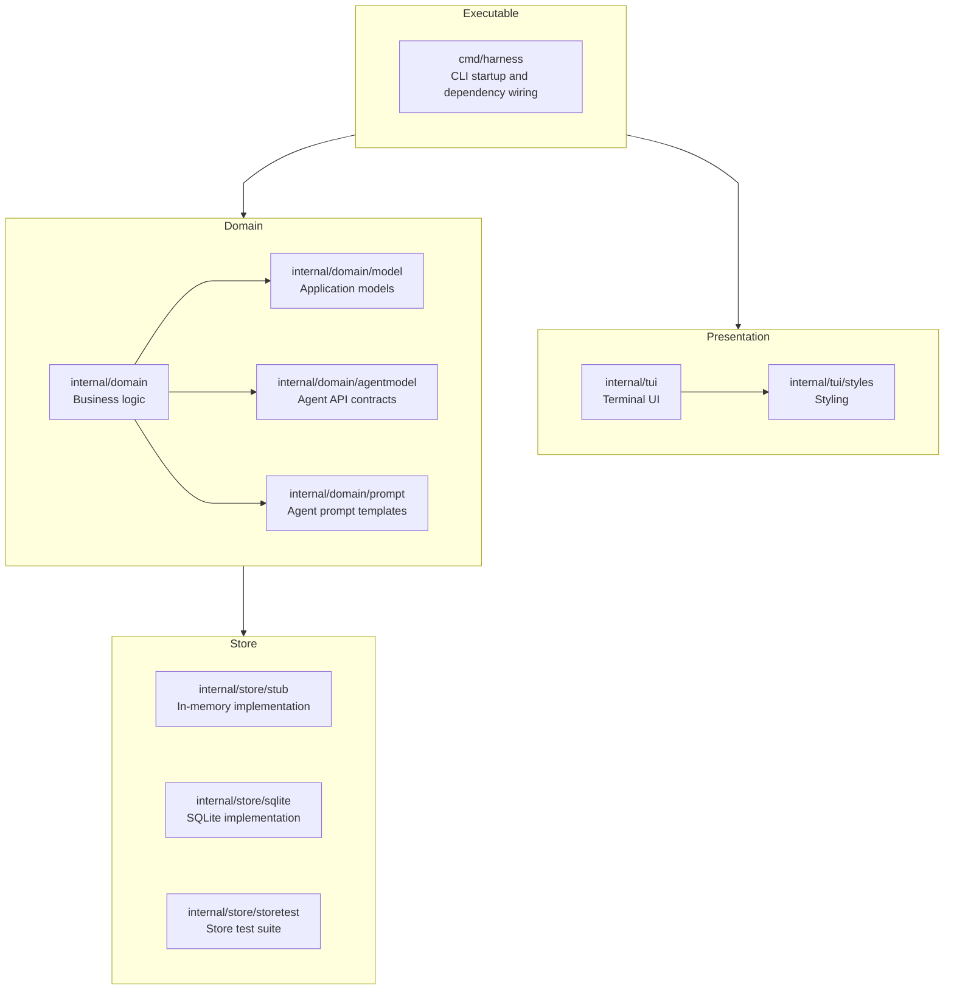

```
date: 2026-09-07
version: v1.1.0
```

---

# Application Design

## Principals

This application follows an onion architecture. 

- The domain should never import from the presentation (tui) or store layers, but these other layers may import from domain.
- When the domain needs to interact with something outside of itself, it should define an interface. For example, define a store interface, rather than importing from the store package.

## Diagram


