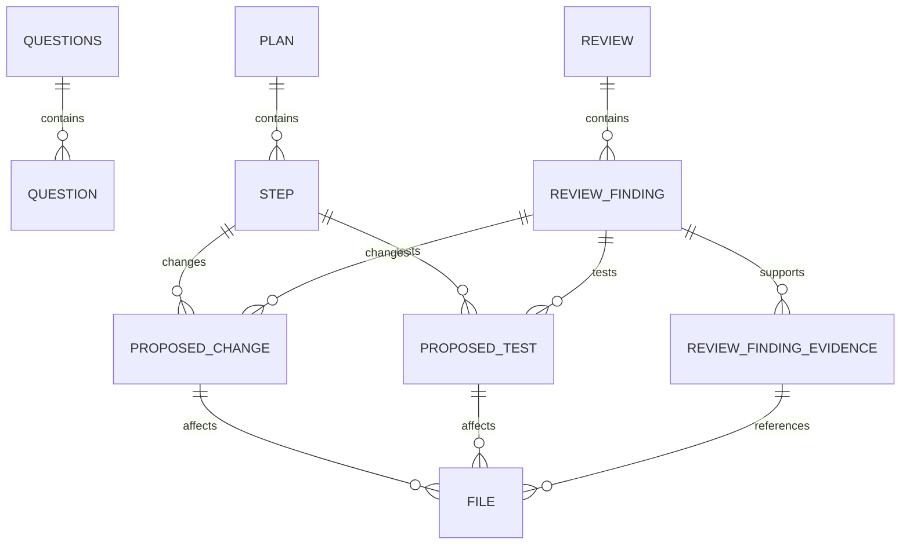

```
date: 2026-09-07
version: v1.0.0
```

---

# Data Design - Agent

Implemented by `internal/domain/agentmodel`.

The agent models define the JSON documents that Harness accepts from an agent. Harness rejects responses that do not match an accepted model. It sanitizes and verifies accepted responses before storage.

## Conventions

- JSON field names use snake case.
- Enum values use their exact PascalCase names.
- Agent-sourced IDs are local identifiers in the response.
- A plan step ID typically uses `S1`, `S2`, or a similar value.
- A question ID typically uses `Q1`, `Q2`, or a similar value.
- A review finding ID typically uses `R1`, `R2`, or a similar value.
- `Step.dependencies` contains agent-sourced step IDs.
- `File.line` is nullable.
- `ProposedTest` includes the fields from `ProposedChange` at the same object level.

## Top-level Documents

| Document    | Purpose                                      |
| ----------- | -------------------------------------------- |
| `Plan`      | Defines the steps to complete a task.        |
| `Questions` | Requests answers from the user.              |
| `Review`    | Records the result of one task review pass.  |

## Logical Model



## Plan

| Field                | Type                    | Notes                                      |
| -------------------- | ----------------------- | ------------------------------------------ |
| `title`              | `string`                | Short sentence that describes the plan    |
| `description`        | `string`                | Goals, reasoning, and purpose              |
| `steps`              | `array<Step>`           | Steps required to complete the plan        |
| `definition_of_done` | `array<string>`         | Completion conditions for the full plan   |
| `risks`              | `array<string>`         | Identified risks for the full plan         |

## Step

A step contains sufficient information to execute it without other plan context. It describes what to change, where to change it, why the change is necessary, and how to make the change.

| Field              | Type                    | Notes                                              |
| ------------------ | ----------------------- | -------------------------------------------------- |
| `id`               | `string`                | Agent-sourced step identifier                      |
| `title`            | `string`                | Short sentence that describes the step             |
| `summary`          | `string`                | Goals, reasoning, and purpose                       |
| `proposed_changes` | `array<ProposedChange>` | Changes or additions to files                      |
| `proposed_tests`   | `array<ProposedTest>`   | Changes or additions to tests                      |
| `verifications`    | `array<string>`         | Verification steps and commands to run             |
| `risks`            | `array<string>`         | Identified risks for the step                       |
| `dependencies`     | `array<string>`         | Step IDs that must complete before this step starts |

### Constraints and invariants

- A step with one or more `proposed_changes` must include proposed test updates or additions.

## Proposed Change

| Field         | Type          | Notes                                     |
| ------------- | ------------- | ----------------------------------------- |
| `description` | `string`      | One-to-three-sentence description         |
| `reason`      | `string`      | One-to-three-sentence reason              |
| `files`       | `array<File>` | Files affected by the proposed change     |

## Proposed Test

`ProposedTest` extends `ProposedChange`. Its JSON object contains all four fields at the same level.

| Field         | Type            | Notes                                 |
| ------------- | --------------- | ------------------------------------- |
| `description` | `string`        | One-to-three-sentence description     |
| `reason`      | `string`        | One-to-three-sentence reason          |
| `files`       | `array<File>`   | Test files affected by the proposal   |
| `test_cases`  | `array<string>` | Test cases that the change must cover |

## Questions

| Field       | Type              | Notes                     |
| ----------- | ----------------- | ------------------------- |
| `questions` | `array<Question>` | Questions for the user    |

## Question

| Field               | Type            | Notes                                  |
| ------------------- | --------------- | -------------------------------------- |
| `id`                | `string`        | Agent-sourced question identifier      |
| `question`          | `string`        | Question of one to three sentences     |
| `suggested_answers` | `array<string>` | Answers suggested by the agent         |

The agent model does not include the user's answer.

## Review

Each review pass produces a review document with one or more findings.

| Field           | Type                   | Notes                                   |
| --------------- | ---------------------- | --------------------------------------- |
| `decision`      | `ReviewDecision`       | Outcome of the review pass              |
| `observations`  | `array<string>`        | Non-blocking observations               |
| `verifications` | `array<string>`        | Verification steps and commands used    |
| `findings`      | `array<ReviewFinding>` | Findings recorded during the review     |

### `ReviewDecision`

- `Unspecified`
- `ChangesRequested`
- `Approved`
- `Rejected`

## Review Finding

| Field              | Type                           | Notes                                   |
| ------------------ | ------------------------------ | --------------------------------------- |
| `id`               | `string`                       | Agent-sourced review finding identifier |
| `severity`         | `ReviewFindingSeverity`        | Effect of the finding on the review     |
| `category`         | `ReviewFindingCategory`        | Classification of the finding           |
| `evidence`         | `array<ReviewFindingEvidence>` | Evidence that supports the finding      |
| `proposed_changes` | `array<ProposedChange>`        | Changes that can resolve the finding    |
| `proposed_tests`   | `array<ProposedTest>`          | Tests for the proposed resolution       |

### `ReviewFindingSeverity`

- `Unspecified`: The severity is not set.
- `Low`: The finding does not block the review.
- `Medium`: The finding blocks the review.
- `High`: The finding blocks the review and identifies an important or severe defect.

### `ReviewFindingCategory`

- `Unspecified`
- `Bug`

The agent model does not include the durable finding status.

## Review Finding Evidence

Each evidence object describes one logical piece of evidence. It identifies where, when, why, or how the problem occurs.

| Field         | Type          | Notes                                |
| ------------- | ------------- | ------------------------------------ |
| `description` | `string`      | Description of the evidence          |
| `files`       | `array<File>` | Files related to the evidence        |

## File

| Field       | Type                | Notes                              |
| ----------- | ------------------- | ---------------------------------- |
| `target_id` | `string`            | Identifier of the target           |
| `path`      | `string`            | Path to the file                   |
| `line`      | `integer` or `null` | Relevant line, if applicable       |
| `exists`    | `boolean`           | Whether the file exists            |