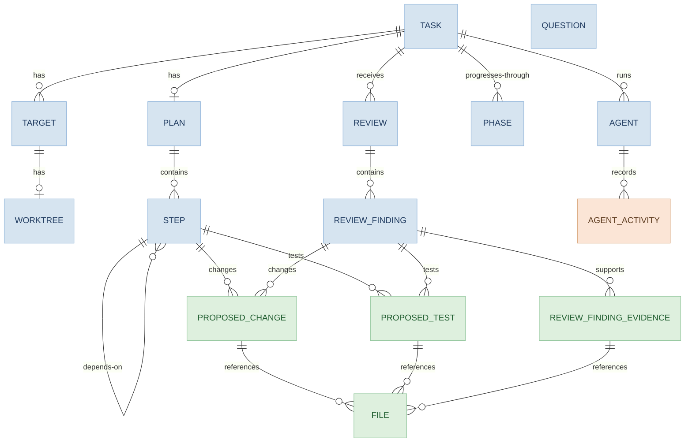

```
date: 2026-09-07
version: v1.0.0
```

---

# Data Design - Domain

Implemented by `internal/domain/model`.

The domain models represent workflow state, revisioned documents, and events. This document describes the implemented Go models.

## Conventions

- JSON field names use snake case.
- String enum values use their exact PascalCase names.
- Each enum includes `Unspecified`, which means the value is not set. This mirrors the protobuf standard for enums.
- Generated string enums provide `String`, `IsValid`, `Parse<Type>`, and `ErrInvalid<Type>`.
- A pointer field is nullable.
- Entity and event models include `CreatedAt`, nullable `UpdatedAt`, and nullable `DeletedAt`, even when the workflow does not yet update or delete them.
    - `AgentActivity` includes only `CreatedAt`. It is an immutable event, so it omits `UpdatedAt` and `DeletedAt`.
- Nested document values do not include these timestamps.
- The model package defines `DeletedAt` but does not implement deletion behavior.
- `lineage.RevisionedField[T]` stores the history of a field instead of only its current value.
- `AgentActivity.ID` is a `uuid.UUID`. Other `ID` fields are strings.
- Revision fields, such as `Revision`, `PlanRevision`, and `ReviewRevision`, use `int64`.
- Status descriptions below state workflow meanings. The model package defines the values but does not enforce state transitions.

## Model Groups

| Group | Models |
| --- | --- |
| Entities | `Task`, `Target`, `Worktree`, `Plan`, `Step`, `Review`, `ReviewFinding`, `Question`, `Phase`, `Agent` |
| Events | `AgentActivity` |
| Values | `AutomationPolicy`, `ProposedChange`, `ProposedTest`, `File`, `ReviewFindingEvidence` |

## Logical Model



Box colors show the model group: blue for entities, peach for events, green for values.

The diagram shows logical relationships, not storage tables. `ProposedChange`, `ProposedTest`, `File`, and `ReviewFindingEvidence` are nested values without IDs.

`Question` has no relationships. The models do not currently link questions to plans, reviews, or other entities.

`Step.Dependencies` stores step IDs directly. Revisioned `Plan.Steps` and `Review.Findings` also contain `Step` and `ReviewFinding` values.

## Task

`Task` is the minimal identity and display data shown in the task list.

| Field | Go type | JSON field | Notes |
| --- | --- | --- | --- |
| `ID` | `string` | `id` | Task identifier |
| `Title` | `string` | `title` | Short display name |
| `Description` | `string` | `description` | Complete user request |
| `Status` | `TaskStatus` | `status` | Task lifecycle state |
| `AutomationPolicy` | `AutomationPolicy` | `automation_policy` | Approval mode for each phase |
| `CreatedAt` | `time.Time` | `created_at` | Creation time |
| `UpdatedAt` | `*time.Time` | `updated_at` | Last-update time |
| `DeletedAt` | `*time.Time` | `deleted_at` | Deletion time |

`NewTask(title)` returns `(Task, error)`. It sets the title, a new `TASK-` ID, `Ready` status, and the current UTC creation time. The other fields keep their zero values.

`LastActive` returns `UpdatedAt` when present and `CreatedAt` otherwise. `Compare` orders active tasks first, then places later `LastActive` values first.

### `TaskStatus`

- `Unspecified`: The status is not set.
- `Ready`: The task can start or resume.
- `Running`: A phase is active.
- `PendingFeedback`: The task waits for user input.
- `Completed`: The workflow is complete.
- `Canceled`: The user stopped the task.
- `Failed`: An error stopped the task.

`IsActive` returns true for `Ready`, `Running`, `PendingFeedback`, and `Failed`.

`TaskStatus` also provides `Symbol` and `Text`. `Text` combines the symbol with the enum name.

### `AutomationPolicy`

| Field | Go type | JSON field |
| --- | --- | --- |
| `Worktree` | `AutomationPolicyType` | `worktree` |
| `Plan` | `AutomationPolicyType` | `plan` |
| `Execute` | `AutomationPolicyType` | `execute` |
| `Review` | `AutomationPolicyType` | `review` |
| `Apply` | `AutomationPolicyType` | `apply` |

### `AutomationPolicyType`

- `Unspecified`: The approval mode is not set.
- `Manual`: Harness waits for user approval.
- `Automatic`: Harness continues without user approval.

## Target

`Target` is a file or directory path associated with a task.

| Field | Go type | JSON field | Notes |
| --- | --- | --- | --- |
| `ID` | `string` | `id` | Target identifier |
| `TaskID` | `string` | `task_id` | Related task |
| `Path` | `string` | `path` | File or directory path |
| `Type` | `TargetType` | `type` | Kind of target |
| `Purpose` | `TargetPurpose` | `purpose` | Allowed access |
| `CreatedAt` | `time.Time` | `created_at` | Creation time |
| `UpdatedAt` | `*time.Time` | `updated_at` | Last-update time |
| `DeletedAt` | `*time.Time` | `deleted_at` | Deletion time |

### `TargetType`

- `Unspecified`: The target type is not set.
- `Generic`: The path has no specific format.
- `VersionControlGit`: The path contains a Git repository.

### `TargetPurpose`

- `Unspecified`: The target purpose is not set.
- `Read`: Harness can read the target.
- `ReadWrite`: Harness can read and change the target.

## Worktree

`Worktree` is a Git worktree created for a `VersionControlGit` target.

| Field | Go type | JSON field | Notes |
| --- | --- | --- | --- |
| `ID` | `string` | `id` | Worktree identifier |
| `TargetID` | `string` | `target_id` | Related target |
| `StartRef` | `string` | `start_ref` | Requested Git commit-ish |
| `HeadCommit` | `*string` | `head_commit` | Resolved commit SHA |
| `WorktreePath` | `*string` | `worktree_path` | Worktree path |
| `Status` | `WorktreeStatus` | `status` | Worktree lifecycle state |
| `CreatedAt` | `time.Time` | `created_at` | Creation time |
| `UpdatedAt` | `*time.Time` | `updated_at` | Last-update time |
| `DeletedAt` | `*time.Time` | `deleted_at` | Deletion time |

### `WorktreeStatus`

- `Unspecified`: The status is not set.
- `Pending`: Preparation did not start.
- `Preparing`: Harness creates or inspects the worktree.
- `Ready`: The worktree is available.
- `Removed`: Harness removed the worktree.

## Plan

`Plan` is the revisioned plan document for a task.

| Field | Go type | JSON field | Notes |
| --- | --- | --- | --- |
| `ID` | `string` | `id` | Plan identifier |
| `Revision` | `int64` | `revision` | Current plan revision |
| `TaskID` | `string` | `task_id` | Related task |
| `Title` | `RevisionedField[string]` | `title` | Revisioned short title |
| `Description` | `RevisionedField[string]` | `description` | Revisioned goals, reasoning, and purpose |
| `Status` | `RevisionedField[PlanStatus]` | `status` | Revisioned lifecycle state |
| `Risks` | `RevisionedField[[]string]` | `risks` | Revisioned plan risks |
| `DefinitionOfDone` | `RevisionedField[[]string]` | `definition_of_done` | Revisioned completion conditions |
| `Steps` | `RevisionedField[[]Step]` | `steps` | Revisioned executable steps |
| `CreatedAt` | `time.Time` | `created_at` | Creation time |
| `UpdatedAt` | `*time.Time` | `updated_at` | Last-update time |
| `DeletedAt` | `*time.Time` | `deleted_at` | Deletion time |

### `PlanStatus`

- `Unspecified`: The status is not set.
- `Draft`: The plan can change.
- `Accepted`: Harness can execute the plan.

## Step

`Step` is an executable unit from an accepted plan revision.

`Plan.Steps` stores this type in revision history. `PlanID`, `PlanRevision`, and `Status` support execution tracking after plan acceptance.

| Field | Go type | JSON field | Notes |
| --- | --- | --- | --- |
| `ID` | `string` | `id` | Agent-local ID before acceptance. Durable ID after acceptance |
| `PlanID` | `string` | `plan_id` | Related plan |
| `PlanRevision` | `int64` | `plan_revision` | Plan revision that produced the step |
| `Status` | `StepStatus` | `status` | Lifecycle state, not revisioned |
| `Title` | `string` | `title` | Short display name |
| `Summary` | `string` | `summary` | Goals, reasoning, and purpose |
| `ProposedChanges` | `[]ProposedChange` | `proposed_changes` | Proposed production changes |
| `ProposedTests` | `[]ProposedTest` | `proposed_tests` | Proposed test changes |
| `Verifications` | `[]string` | `verifications` | Verification steps and commands |
| `Risks` | `[]string` | `risks` | Step risks |
| `Dependencies` | `[]string` | `depends_on` | IDs of prerequisite steps |
| `CreatedAt` | `time.Time` | `created_at` | Creation time |
| `UpdatedAt` | `*time.Time` | `updated_at` | Last-update time |
| `DeletedAt` | `*time.Time` | `deleted_at` | Deletion time |

### `StepStatus`

- `Unspecified`: The status is not set.
- `Pending`: One or more dependencies are incomplete.
- `Ready`: All dependencies are complete.
- `Running`: An executor works on the step.
- `PendingFeedback`: The step waits for user input.
- `Completed`: Execution completed.
- `Canceled`: The user or a dependency stopped the step.
- `Failed`: An error or dependency failure stopped the step.

## Proposed Change

`ProposedChange` describes a change and the files that it affects.

| Field | Go type | JSON field | Notes |
| --- | --- | --- | --- |
| `Description` | `string` | `description` | Description of the change |
| `Reason` | `string` | `reason` | Reason for the change |
| `Files` | `RevisionedField[[]File]` | `files` | Revisioned affected files |

## Proposed Test

`ProposedTest` embeds `ProposedChange`. Its JSON fields are at the same object level.

| Field | Go type | JSON field | Notes |
| --- | --- | --- | --- |
| `ProposedChange` | `ProposedChange` | Embedded | Description, reason, and revisioned files |
| `TestCases` | `RevisionedField[[]string]` | `test_cases` | Revisioned test cases |

## File

`File` identifies a file location used in plans and reviews.

| Field | Go type | JSON field | Notes |
| --- | --- | --- | --- |
| `TargetID` | `string` | `target_id` | Related target |
| `Path` | `string` | `path` | File path |
| `Line` | `*int64` | `line` | Relevant line |
| `Exists` | `bool` | `exists` | Whether the file exists |

## Review

`Review` is a revisioned, multi-pass review of a task. The model uses `Revision` as the review-pass revision and does not define a separate pass field.

| Field | Go type | JSON field | Notes |
| --- | --- | --- | --- |
| `ID` | `string` | `id` | Review identifier |
| `Revision` | `int64` | `revision` | New revision for each review pass |
| `TaskID` | `string` | `task_id` | Related task |
| `Decision` | `RevisionedField[ReviewDecision]` | `decision` | Revisioned review outcome |
| `Observations` | `RevisionedField[[]string]` | `observations` | Revisioned non-blocking observations |
| `Verifications` | `RevisionedField[[]string]` | `verifications` | Revisioned verification steps and commands |
| `Findings` | `RevisionedField[[]ReviewFinding]` | `findings` | Revisioned findings |
| `CreatedAt` | `time.Time` | `created_at` | Creation time |
| `UpdatedAt` | `*time.Time` | `updated_at` | Last-update time |
| `DeletedAt` | `*time.Time` | `deleted_at` | Deletion time |

### `ReviewDecision`

- `Unspecified`: The decision is not set.
- `ChangesRequested`: Correctable findings require more work.
- `Approved`: The reviewed work is approved.
- `Rejected`: The reviewed work cannot continue.

## Review Finding

`ReviewFinding` is a revisioned finding recorded against a review.

`Review.Findings` stores this type in revision history. Each finding also has `ReviewID` and its own `Revision` for separate tracking.

| Field | Go type | JSON field | Notes |
| --- | --- | --- | --- |
| `ID` | `string` | `id` | Finding identifier |
| `Revision` | `int64` | `revision` | Current finding revision |
| `ReviewID` | `string` | `review_id` | Related review |
| `Severity` | `ReviewFindingSeverity` | `severity` | Finding severity, not revisioned |
| `Category` | `ReviewFindingCategory` | `category` | Finding category, not revisioned |
| `Status` | `RevisionedField[ReviewFindingStatus]` | `status` | Revisioned disposition |
| `Evidence` | `RevisionedField[[]ReviewFindingEvidence]` | `evidence` | Revisioned supporting evidence |
| `ProposedChanges` | `RevisionedField[[]ProposedChange]` | `proposed_changes` | Revisioned proposed changes |
| `ProposedTests` | `RevisionedField[[]ProposedTest]` | `proposed_tests` | Revisioned proposed tests |
| `CreatedAt` | `time.Time` | `created_at` | Creation time |
| `UpdatedAt` | `*time.Time` | `updated_at` | Last-update time |
| `DeletedAt` | `*time.Time` | `deleted_at` | Deletion time |

### `ReviewFindingSeverity`

- `Unspecified`: The severity is not set.
- `Low`: The finding does not block the review.
- `Medium`: The finding blocks the review.
- `High`: The finding blocks the review and identifies an important or severe defect.

### `ReviewFindingCategory`

- `Unspecified`: The category is not set.
- `Bug`: The finding identifies incorrect behavior or implementation.

### `ReviewFindingStatus`

- `Unspecified`: The finding awaits a disposition.
- `Unresolved`: The finding requires action.
- `Ignored`: The finding does not require action.
- `Rejected`: The finding is not valid.
- `Resolved`: The finding is corrected.

## Review Finding Evidence

`ReviewFindingEvidence` describes one logical piece of evidence. It represents where, when, why, or how a finding occurs.

| Field | Go type | JSON field | Notes |
| --- | --- | --- | --- |
| `Description` | `string` | `description` | Description of the evidence |
| `Files` | `RevisionedField[[]File]` | `files` | Revisioned related files |

## Question

`Question` is a prompt that waits for a user answer.

| Field | Go type | JSON field | Notes |
| --- | --- | --- | --- |
| `ID` | `string` | `id` | Question identifier |
| `Question` | `string` | `question` | Prompt shown to the user |
| `SuggestedAnswers` | `[]string` | `suggested_answers` | Suggested answers |
| `Answer` | `*string` | `answer` | User answer |
| `CreatedAt` | `time.Time` | `created_at` | Creation time |
| `UpdatedAt` | `*time.Time` | `updated_at` | Last-update time |
| `DeletedAt` | `*time.Time` | `deleted_at` | Deletion time |

## Phase

`Phase` represents one workflow phase of a task.

| Field | Go type | JSON field | Notes |
| --- | --- | --- | --- |
| `ID` | `string` | `id` | Phase identifier |
| `TaskID` | `string` | `task_id` | Related task |
| `Type` | `PhaseType` | `type` | Kind of phase |
| `Status` | `PhaseStatus` | `status` | Phase lifecycle state |
| `Error` | `*string` | `error` | Error message |
| `CreatedAt` | `time.Time` | `created_at` | Creation time |
| `UpdatedAt` | `*time.Time` | `updated_at` | Last-update time |
| `DeletedAt` | `*time.Time` | `deleted_at` | Deletion time |

### `PhaseType`

- `Unspecified`
- `Worktree`
- `Plan`
- `Execute`
- `Review`
- `Apply`

### `PhaseStatus`

- `Unspecified`: The status is not set.
- `Pending`: The phase waits for an earlier phase.
- `Ready`: The phase can start.
- `Running`: The phase is active.
- `Feedback`: The phase waits for user input.
- `Completed`: The phase completed.
- `Canceled`: The user stopped the phase.
- `Failed`: An error stopped the phase.

## Agent

`Agent` represents one agent run for a task.

| Field | Go type | JSON field | Notes |
| --- | --- | --- | --- |
| `ID` | `string` | `id` | Agent-run identifier |
| `TaskID` | `string` | `task_id` | Related task |
| `Role` | `AgentRole` | `role` | Agent role |
| `Model` | `string` | `model` | Language-model identifier |
| `CreatedAt` | `time.Time` | `created_at` | Creation time |
| `UpdatedAt` | `*time.Time` | `updated_at` | Last-update time |
| `DeletedAt` | `*time.Time` | `deleted_at` | Deletion time |

### `AgentRole`

- `Unspecified`: The role is not set.
- `Planner`: Creates or refines a plan.
- `PlanReviewer`: Reviews a plan revision.
- `Executor`: Runs a plan step.
- `Reviewer`: Reviews executed work.

## Agent Activity

`AgentActivity` is an immutable event for one agent run. Because it is immutable, it omits `UpdatedAt` and `DeletedAt`.

Immutability is a workflow constraint. The model package does not enforce it.

| Field | Go type | JSON field | Notes |
| --- | --- | --- | --- |
| `ID` | `uuid.UUID` | `id` | Activity identifier |
| `AgentID` | `string` | `agent_id` | Related agent run |
| `Type` | `AgentActivityType` | `type` | Event type |
| `Log` | `[]byte` | `log` | Structured log bytes, encoded as a base64 string in JSON |
| `CreatedAt` | `time.Time` | `created_at` | Creation time |

### `AgentActivityType`

- `Unspecified`
- `Start`
- `ToolCall`
- `Read`
- `Write`
- `Error`
- `Complete`
