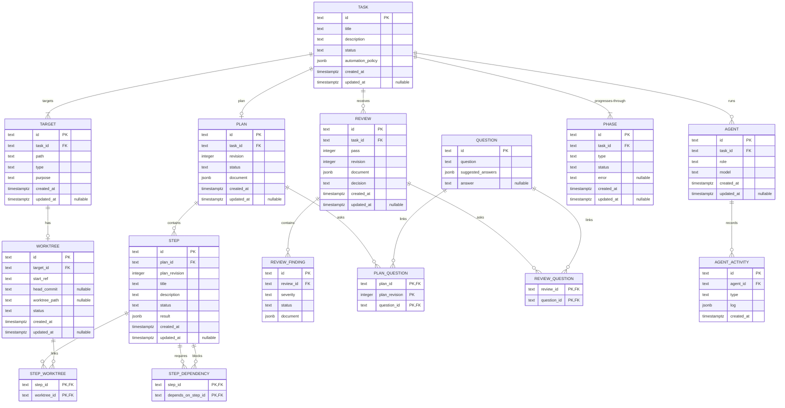

date: 2026-09-04
version: v1.3.0

---

# Data Design

Harness stores durable workflow state in a database. The store layer isolates the application from the database.

## Conventions

- All timestamps must be normalized to UTC.
- A null value represents intentional omission. 
- Each enum includes `Unspecified`.
- The database stores enums as their exact PascalCase names in `text` columns.
- Each entity ID contains a four-letter prefix, a hyphen, and eight Crockford Base32 characters.
- Revision numbers, such as `Revision`, start at 1 and increase by 1.
- Review `Pass` values start at 1 and increase by 1.
- `Plan.Document` and `Review.Document` store all document revisions.
- Each plan and review row stores its latest document revision in `Revision`.
- A new document revision updates the existing plan or review row. It does not insert another row.
- The update must match the current `Revision` and increment it in the same statement.
- If the update affects no row, Harness reports an optimistic-lock conflict.

## Unique Identifiers

| Entity | ID prefix |
| --- | --- |
| Task | `TASK-` |
| Target | `TARG-` |
| Worktree | `WORK-` |
| Plan | `PLAN-` |
| Step | `STEP-` |
| Review | `REVI-` |
| Review finding | `FIND-` |
| Question | `QUES-` |
| Phase | `PHAS-` |
| Agent | `AGEN-` |
| Agent activity | `ACTI-` |

## JSONB Columns

The following columns use JSONB. The application defines and maintains their schemas.

| Column | Shape |
| --- | --- |
| `task.automation_policy` | object |
| `plan.document` | revision history object |
| `step.result` | any valid JSON value |
| `review.document` | revision history object |
| `review_finding.document` | object |
| `question.suggested_answers` | array |
| `agent_activity.log` | object |

## Logical Model

## Task

| Field | Type | Notes |
| --- | --- | --- |
| `ID` | `text` | Primary key |
| `Title` | `text` | Short display name |
| `Description` | `text` | Complete user request |
| `Status` | `text` | `TaskStatus` |
| `AutomationPolicy` | `jsonb` | `AutomationPolicy` |
| `CreatedAt` | `timestamptz` | |
| `UpdatedAt` | `timestamptz` | Nullable |

### `TaskStatus`

- `Ready`: The task can start or resume.
- `Running`: A phase is active.
- `PendingFeedback`: The task waits for user input.
- `Completed`: The Apply phase is complete.
- `Canceled`: The user stopped the task.
- `Failed`: A system or agent error stopped the task.

### `AutomationPolicy`

| Field | Type |
| --- | --- |
| `Worktree` | `AutomationPolicyType` |
| `Plan` | `AutomationPolicyType` |
| `Execute` | `AutomationPolicyType` |
| `Review` | `AutomationPolicyType` |
| `Apply` | `AutomationPolicyType` |

### `AutomationPolicyType`

- `Manual`: Harness waits for user approval.
- `Automatic`: Harness continues without user input.

### Indexes

- (`Status`, `UpdatedAt`): Supports the default task list.

## Target

| Field | Type | Notes |
| --- | --- | --- |
| `ID` | `text` | Primary key |
| `TaskID` | `text` | Foreign key to `task.ID` |
| `Path` | `text` | File or directory path |
| `Type` | `text` | `TargetType` |
| `Purpose` | `text` | `TargetPurpose` |
| `CreatedAt` | `timestamptz` | |
| `UpdatedAt` | `timestamptz` | Nullable |

### `TargetType`

- `Generic`: Directory or File path. No specific format.
- `VersionControlGit`: Directory path containing a Git repository.

### `TargetPurpose`

- `Read`
- `ReadWrite`

### Constraints and invariants

- `UNIQUE (TaskID, Path)`
- `CHECK (Purpose <> 'ReadWrite' OR Type = 'VersionControlGit')`
- A `VersionControlGit` target path is the absolute repository root from `git rev-parse --show-toplevel`.

## Worktree

The Worktree phase creates one worktree for each `VersionControlGit` target. A `Generic` target remains read-only context.

| Field | Type | Notes |
| --- | --- | --- |
| `ID` | `text` | Primary key |
| `TargetID` | `text` | Foreign key to `target.ID` |
| `StartRef` | `text` | Requested Git commit-ish |
| `HeadCommit` | `text` | Resolved commit SHA, nullable |
| `WorktreePath` | `text` | Path in the Harness state directory, nullable |
| `Status` | `text` | `WorktreeStatus` |
| `CreatedAt` | `timestamptz` | |
| `UpdatedAt` | `timestamptz` | Nullable |

### `WorktreeStatus`

- `Pending`: Preparation did not start.
- `Preparing`: Harness creates or inspects the worktree.
- `Ready`: The worktree is available.
- `Removed`: Harness removed the worktree.

### Constraints and invariants

- `UNIQUE (TargetID)`
- The target type must be `VersionControlGit`. The application enforces this rule.
- `StartRef` must not be empty.
- A `Ready` or `Removed` worktree must have `HeadCommit` and `WorktreePath` values.
- Harness records `HeadCommit` immediately after worktree creation and does not update it after later commits.
- The Worktree phase `Error` contains one aggregate error summary. Each update replaces the previous summary.

## Plan

A task has at most one plan row. Each refinement appends a revision to `Document` and updates that row.

Harness can accept only the revision identified by `Revision`. An accepted plan is final.

| Field | Type | Notes |
| --- | --- | --- |
| `ID` | `text` | Primary key |
| `TaskID` | `text` | Foreign key to `task.ID` |
| `Revision` | `integer` | Latest document revision |
| `Status` | `text` | `PlanStatus` |
| `Document` | `jsonb` | Full payload for all plan revisions |
| `CreatedAt` | `timestamptz` | |
| `UpdatedAt` | `timestamptz` | Nullable |

### `PlanStatus`

- `Draft`
- `Accepted`: Harness can run steps whose `PlanRevision` equals `Revision`.

### Constraints and invariants

- `PRIMARY KEY (ID)`
- `UNIQUE (TaskID)`

## Step

Harness runs only steps from the accepted plan revision.

| Field | Type | Notes |
| --- | --- | --- |
| `ID` | `text` | Primary key |
| `PlanID` | `text` | Foreign key to `plan.ID` |
| `PlanRevision` | `integer` | Plan revision that produced the step |
| `Title` | `text` | Short display name |
| `Description` | `text` | Complete execution instructions |
| `Status` | `text` | `StepStatus` |
| `Result` | `jsonb` | Structured agent result |
| `CreatedAt` | `timestamptz` | |
| `UpdatedAt` | `timestamptz` | Nullable |

### `StepStatus`

- `Pending`: One or more dependencies are incomplete.
- `Ready`: All dependencies are `Completed`.
- `Running`: An executor works on the step.
- `PendingFeedback`: The step waits for user input.
- `Completed`
- `Canceled`: The user or a canceled dependency stopped the step.
- `Failed`: An error or a failed dependency stopped the step.

### Constraints and invariants

- `step_by_plan_revision_and_status (PlanID, PlanRevision, Status)`
- Payload-local IDs do not appear in `ID`.
- `PlanRevision` must identify a revision in `Plan.Document`.
- Harness runs a step only when the plan is `Accepted` and `PlanRevision` equals `Plan.Revision`.

## Step Dependency

| Field | Type | Notes |
| --- | --- | --- |
| `StepID` | `text` | Dependent step, foreign key to `step.ID` |
| `DependsOnStepID` | `text` | Prerequisite step, foreign key to `step.ID` |

### Constraints and invariants

- `PRIMARY KEY (StepID, DependsOnStepID)`
- `step_dependency_by_dependency (DependsOnStepID)`
- `CHECK (StepID <> DependsOnStepID)`
- Both steps must belong to the same plan revision.
- The dependency graph must not contain a cycle.
- Payload-local IDs do not appear in either field.

When a prerequisite reaches a terminal status, Harness applies these rules to each pending dependent:

1. If any prerequisite is `Failed`, set the dependent to `Failed`.
2. Otherwise, if any prerequisite is `Canceled`, set the dependent to `Canceled`.
3. Otherwise, if all prerequisites are `Completed`, set the dependent to `Ready`.
4. Otherwise, do not change the dependent.

Harness does not wait for other prerequisites after a failure or cancellation. It applies the same rules after restart.

## Step Worktree

| Field | Type | Notes |
| --- | --- | --- |
| `StepID` | `text` | Foreign key to `step.ID` |
| `WorktreeID` | `text` | Foreign key to `worktree.ID` |

### Constraints and invariants

- `PRIMARY KEY (StepID, WorktreeID)`
- `(WorktreeID)`
- The worktree and step must belong to the same task.
- The worktree target must have purpose `ReadWrite`.

## Review

Each review row stores one review pass. An agent with role `Reviewer` creates the review.

The database does not link a review to its agent.

| Field | Type | Notes |
| --- | --- | --- |
| `ID` | `text` | Primary key |
| `TaskID` | `text` | Foreign key to `task.ID` |
| `Pass` | `integer` | Review pass within the task |
| `Revision` | `integer` | Latest document revision |
| `Document` | `jsonb` | Full payload for all revisions of this review |
| `Decision` | `text` | `ReviewDecision` |
| `CreatedAt` | `timestamptz` | |
| `UpdatedAt` | `timestamptz` | Nullable |

Harness writes the review and its finding rows in one transaction.

Harness assigns each finding a durable ID.

### `ReviewDecision`

- `ChangesRequested`: Correctable findings return to execution.
- `Accepted`: The result can continue to apply authorization.
- `Rejected`: The result cannot continue to apply.

### Constraints and invariants

- `UNIQUE (TaskID, Pass)`
- Harness inserts a review only while the Review phase is `Running`.
- The reviewer agent must belong to the task and have role `Reviewer`.

## Review Finding

| Field | Type | Notes |
| --- | --- | --- |
| `ID` | `text` | Primary key |
| `ReviewID` | `text` | Foreign key to `review.ID` |
| `Severity` | `text` | `FindingSeverity` |
| `Status` | `text` | `ReviewFindingStatus` |
| `Document` | `jsonb` | Finding snapshot |

### `FindingSeverity`

- `High`: Blocks the review and identifies an important or severe defect.
- `Medium`: Blocks the review.
- `Low`: Does not block the review.

### `ReviewFindingStatus`

- `Unspecified`: The finding awaits a disposition.
- `Unresolved`: The finding requires action.
- `Ignored`: The finding does not require action.
- `Rejected`: The finding is not valid.
- `Resolved`: The finding is corrected.

### Constraints and invariants

- `(ReviewID, Severity)`
- Payload-local IDs do not appear in `ID`.
- After insertion, Harness can update only `Status`.
- Harness cannot set a review to `Accepted` while any finding is `Unspecified` or `Unresolved`.
- When Harness creates a `ChangesRequested` review, it writes at least one `High` or `Medium` finding.

## Question

| Field | Type | Notes |
| --- | --- | --- |
| `ID` | `text` | Primary key |
| `Question` | `text` | |
| `SuggestedAnswers` | `jsonb` | String array |
| `Answer` | `text` | Nullable |

## Question Links

### Plan Question

| Field | Type | Notes |
| --- | --- | --- |
| `PlanID` | `text` | Foreign key to `plan.ID` |
| `PlanRevision` | `integer` | Linked revision in `plan.Document` |
| `QuestionID` | `text` | Foreign key to `question.ID` |

- `PRIMARY KEY (PlanID, PlanRevision, QuestionID)`
- `(QuestionID)`
- `PlanRevision` must identify a revision in `Plan.Document`.

### Review Question

| Field | Type | Notes |
| --- | --- | --- |
| `ReviewID` | `text` | Foreign key to `review.ID` |
| `QuestionID` | `text` | Foreign key to `question.ID` |

- `PRIMARY KEY (ReviewID, QuestionID)`
- `(QuestionID)`

## Phase

Each task has one phase for each non-`Unspecified` phase type.

| Field | Type | Notes |
| --- | --- | --- |
| `ID` | `text` | Primary key |
| `TaskID` | `text` | Foreign key to `task.ID` |
| `Type` | `text` | `PhaseType` |
| `Status` | `text` | `PhaseStatus` |
| `Error` | `text` | Nullable |
| `CreatedAt` | `timestamptz` | |
| `UpdatedAt` | `timestamptz` | Nullable |

### `PhaseType`

- `Worktree`
- `Plan`
- `Execute`
- `Review`
- `Apply`

### `PhaseStatus`

- `Pending`: The phase waits for an earlier phase.
- `Ready`: The phase can start.
- `Running`: The phase is active.
- `Feedback`: The phase waits for user input.
- `Completed`
- `Canceled`: The user stopped the task.
- `Failed`: An error stopped the phase.

### Constraints and invariants

- `UNIQUE (TaskID, Type)`
- `(TaskID, Status, UpdatedAt)`
- Task creation writes all five phase rows in the task transaction.
- Harness does not start the workflow unless all five rows exist.

### Apply

Harness applies only worktrees for `ReadWrite` targets. It does not change `Read` targets.

Harness does not store destinations, apply operations, result SHAs, or partial-apply state.

The Apply phase `Error` contains one aggregate error summary. Each update replaces the previous summary.

The user resolves an apply failure. Automatic resolution is not in scope.

## Agent

Each agent row represents one run. Harness does not reuse the row.

The row does not reference a phase, plan, or step. Runtime state or durable leases determine the running state.

| Field | Type | Notes |
| --- | --- | --- |
| `ID` | `text` | Primary key |
| `TaskID` | `text` | Foreign key to `task.ID` |
| `Role` | `text` | `AgentRole` |
| `Model` | `text` | Language-model identifier |
| `CreatedAt` | `timestamptz` | |
| `UpdatedAt` | `timestamptz` | Nullable |

### `AgentRole`

- `Planner`: Creates or refines a plan in the Plan phase.
- `PlanReviewer`: Reviews a revision in the Plan phase.
- `Executor`: Runs a step in the Execute phase.
- `Reviewer`: Creates a review in the Review phase.

### Constraints and invariants

- `(TaskID, Role)`
- After Harness writes a `Start` activity, it does not change the agent row.
- Before `Start`, `UpdatedAt` records the last role or model change.

## Agent Activity

Agent activities are immutable events for one agent run. They do not store phase or task status changes.

| Field | Type | Notes |
| --- | --- | --- |
| `ID` | `text` | Primary key |
| `AgentID` | `text` | Foreign key to `agent.ID` |
| `Type` | `text` | `AgentActivityType` |
| `Log` | `jsonb` | Structured event log |
| `CreatedAt` | `timestamptz` | |

### `AgentActivityType`

- `Start`
- `ToolCall`
- `Read`
- `Write`
- `Error`
- `Complete`

### Constraints

- `(AgentID, CreatedAt)`
- Database triggers reject updates and deletions.
- Task and phase rows store current status. The database does not keep their status history.
