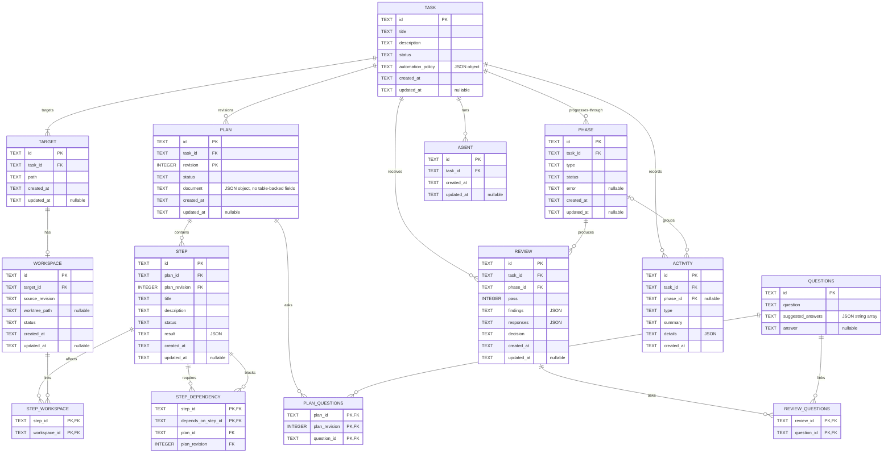

date: 2026-09-04
version: v1.1.1

---

# Data Design

Harness stores durable workflow state in a database. The store layer abstracts the specific database choice away from the rest of the architecture.

The data model contains these items:

- tasks
- targets
- workspaces
- agents
- plans
- steps
- step dependencies
- step-workspace links
- reviews
- questions
- plan-question links
- review-question links
- activities
- phases

Apply is a phase. There is no apply table.

## Rules

All timestamps use UTC. A pointer type represents a nullable value.

All enums must include an `Unspecified` value.

Each entity table uses a unique four-letter ID prefix. A hyphen and an eight-character value in Crockford Base32 follow the prefix.

The `step_dependency`, `step_workspace`, `plan_questions`, and `review_questions` tables are relationship tables. Each relationship table uses a composite primary key. These tables do not have surrogate identifiers.

A `Revision` field starts at 1. Each new revision increases this value by 1.

## Constraint Ownership

### Database constraints

The database schema defines these properties:

- column types
- nullability
- defaults
- identifier formats
- enum values
- JSON validity
- keys
- uniqueness

Each foreign key uses `ON UPDATE RESTRICT` and `ON DELETE RESTRICT`.

The composite foreign keys prevent a step or plan-question link from referencing an incomplete plan key. They prevent a review or activity from naming a phase from a different task.

These keys also prevent a step dependency from naming a step in a different plan revision. The `step_dependency` composite foreign keys reference `step (id, plan_id, plan_revision)`.

The Database stores each `json.RawMessage` value as valid JSON text. The schema enforces each JSON container type that this document defines.

The plan `document` value is a JSON object. It must not contain a `steps` key. The question `suggested_answers` value is a JSON array.

The partial unique index permits a maximum of one accepted revision for each plan. The activity triggers reject changes and deletions after insertion.

## Logical Model



### Transaction rules

- Before the first transaction on each connection, enable `PRAGMA foreign_keys = ON`.
- Then make sure that foreign-key enforcement is active.
- Apply each migration in one transaction.
- After the migration, run `PRAGMA foreign_key_check`.
- If this pragma returns a row, stop startup.
- Use one transaction for each state change that writes more than one row.
- Use `BEGIN IMMEDIATE` for each read-modify-write operation.
- When you allocate a plan revision or review pass, use `BEGIN IMMEDIATE`.
- When you advance workflow state, use `BEGIN IMMEDIATE`.
- For a plan revision, extract the table-backed fields from the agent payload.
- Then write the plan row and the extracted table rows in the same transaction.
- Insert all `step` rows for a plan revision before you insert related `step_dependency` rows.
- Insert each referenced `step` row and `workspace` row before you insert a related `step_workspace` row.
- Read the current state before a state change.
- Make sure that the application invariants hold.
- Write each related task, agent, phase, step, dependency, workspace, review, question, link, and activity change before you commit.
- If a rule or write operation fails, roll back the complete transaction.
- Do not hold a transaction open while Harness waits for user input or an agent, tool, filesystem, or network operation.

## Task

The `task` table stores the user request and its broad lifecycle state.

| Field              | Type               | Purpose                                                                      |
| ------------------ | ------------------ | ---------------------------------------------------------------------------- |
| `ID`               | `string`           | Unique identifier with `TASK-` prefix and 8-character value in Crockford Base32 |
| `Title`            | `string`           | Short display name                                                           |
| `Description`      | `string`           | Complete user request                                                        |
| `Status`           | `TaskStatus`       | Broad lifecycle state                                                        |
| `AutomationPolicy` | `AutomationPolicy` | Input policy for each phase boundary                                         |
| `CreatedAt`        | `time.Time`        | Creation time                                                                |
| `UpdatedAt`        | `*time.Time`       | Time of the last material change                                             |

### Enum: `TaskStatus`

- `Unspecified`
- `Ready`: The task can start or resume.
- `Running`: A phase is active.
- `PendingFeedback`: The task waits for user input.
- `Completed`: The apply phase is complete.
- `Canceled`: The user stopped the task.
- `Failed`: A system or agent error stopped the task.

### Structure: `AutomationPolicy`

| Field       | Type                   | Purpose                           |
| ----------- | ---------------------- | --------------------------------- |
| `Workspace` | `AutomationPolicyType` | Policy for the workspace boundary |
| `Plan`      | `AutomationPolicyType` | Policy for the plan boundary      |
| `Execute`   | `AutomationPolicyType` | Policy for the execute boundary   |
| `Review`    | `AutomationPolicyType` | Policy for the review boundary    |
| `Apply`     | `AutomationPolicyType` | Policy for the apply boundary     |

### Enum: `AutomationPolicyType`

- `Unspecified`
- `Manual`: Harness waits for user approval.
- `Automatic`: Harness continues without user input.

### Indexes

- `Status`, `UpdatedAt`: This index supports the default task list.

## Target

The `target` table stores one path that a task affects. A task has one or more targets.

| Field       | Type         | Purpose                                                                      |
| ----------- | ------------ | ---------------------------------------------------------------------------- |
| `ID`        | `string`     | Unique identifier with `TARG-` prefix and 8-character value in Crockford Base32 |
| `TaskID`    | `string`     | Parent task identifier                                                       |
| `Path`      | `string`     | Source path selected for the task                                            |
| `CreatedAt` | `time.Time`  | Creation time                                                                |
| `UpdatedAt` | `*time.Time` | Time of the last material change                                             |

### Indexes

- `TaskID`, `Path`: This unique index finds the targets for a task. It also prevents duplicate paths.

## Workspace

The `workspace` table stores one isolated location for a target. A target has a maximum of one workspace.

| Field            | Type              | Purpose                                                                      |
| ---------------- | ----------------- | ---------------------------------------------------------------------------- |
| `ID`             | `string`          | Unique identifier with `WORK-` prefix and 8-character value in Crockford Base32 |
| `TargetID`       | `string`          | Parent target identifier                                                     |
| `SourceRevision` | `string`          | Source revision used to create the isolated workspace                        |
| `WorktreePath`   | `*string`         | Worktree path under the Harness state directory                              |
| `Status`         | `WorkspaceStatus` | Preparation and availability state                                           |
| `CreatedAt`      | `time.Time`       | Creation time                                                                |
| `UpdatedAt`      | `*time.Time`      | Time of the last material change                                             |

### Enum: `WorkspaceStatus`

- `Unspecified`
- `Pending`: Preparation did not start.
- `Preparing`: Harness creates or inspects the worktree.
- `Ready`: The worktree is available.
- `Removed`: Harness removed the worktree.

Harness records workspace errors as activity records, not workspace status values.

### Indexes

- `TargetID`: This unique index finds the workspace for a target. It also prevents duplicate workspaces.

## Plan

The `plan` table stores each structured plan revision. The first revision receives a plan ID. Each successful refinement pass creates a new row. The new row uses the same plan ID and the next revision number. The previous row does not change.

If a newer revision exists, the earlier revision is not current. Harness can accept only the current revision. Acceptance updates the existing row. It does not increment the revision number. Harness cannot create a later revision for an accepted plan.

For a plan ID, the row with `Status` set to `Accepted` is the accepted revision. An accepted plan is final.

### Agent payload

The agent returns one JSON object. Harness does not store this object as `Document`.

The object can contain a `steps` array. Each element is one step definition.

| Field         | Type       | Purpose                                                     |
| ------------- | ---------- | ----------------------------------------------------------- |
| `id`          | `string`   | Local identifier. Unique in this payload. Not a `STEP-` ID. |
| `title`       | `string`   | Short display name                                          |
| `description` | `string`   | Complete execution instructions                             |
| `depends_on`  | `[]string` | Local identifiers of steps that must complete first         |

If `depends_on` is absent or empty, the step has no dependencies.

Other top-level fields remain in `Document`. Harness does not store local identifiers.

### Extraction

When Harness writes a plan revision, it removes each field that maps to a dedicated table. The current table-backed field is `steps`. Harness stores step data only in the `step` table. `Plan.Document` does not contain a second copy.

The agent does not assign durable step IDs. When Harness extracts the steps, it assigns a durable `STEP-` ID to each step. Harness maps each local identifier to one assigned ID. Then Harness writes one `step_dependency` row for each mapped edge.

Harness writes the plan, `step`, and `step_dependency` rows in one transaction. It writes all `step` rows before the related `step_dependency` rows. If a rule or write operation fails, Harness rolls back the complete transaction. The database then contains no partial revision.

Acceptance updates the plan status on the existing row. It does not copy steps from `Document`. The `step` and `step_dependency` rows for that revision already exist.

| Field       | Type              | Purpose                                                                                    |
| ----------- | ----------------- | ------------------------------------------------------------------------------------------ |
| `ID`        | `string`          | Identifier with `PLAN-` prefix and 8-character value in Crockford Base32. Shared by revisions. |
| `TaskID`    | `string`          | Parent task identifier                                                                     |
| `Revision`  | `int`             | Revision number within the plan. The first value is 1.                                     |
| `Status`    | `PlanStatus`      | Acceptance state                                                                           |
| `Document`  | `json.RawMessage` | Agent payload after Harness removes table-backed fields                                    |
| `CreatedAt` | `time.Time`       | Creation time                                                                              |
| `UpdatedAt` | `*time.Time`      | Time of the last material change                                                           |

### Enum: `PlanStatus`

- `Unspecified`
- `Draft`: The plan revision is not accepted.
- `Accepted`: Harness can run the step rows of this revision.

### Indexes

- `ID`, `Revision`: This composite primary key identifies one plan revision.
- `TaskID`, `Revision`: This unique index identifies plan revisions for a task.

## Step

The `step` table stores the steps for a plan revision. Harness extracts these rows from the agent payload. Harness stores these rows only in this table. Harness runs only the step rows of the accepted revision.

| Field          | Type              | Purpose                                                                       |
| -------------- | ----------------- | ----------------------------------------------------------------------------- |
| `ID`           | `string`          | Unique identifier with `STEP-` prefix and 8-character value in Crockford Base32. |
| `PlanID`       | `string`          | Parent plan identifier                                                        |
| `PlanRevision` | `int`             | Revision number of the parent plan                                            |
| `Title`        | `string`          | Short display name                                                            |
| `Description`  | `string`          | Complete execution instructions                                               |
| `Status`       | `StepStatus`      | Execution state                                                               |
| `Result`       | `json.RawMessage` | Structured agent result                                                       |
| `CreatedAt`    | `time.Time`       | Creation time                                                                 |
| `UpdatedAt`    | `*time.Time`      | Time of the last material change                                              |

### Enum: `StepStatus`

- `Unspecified`
- `Pending`: One or more dependencies are not `completed`.
- `Ready`: Every dependency has status `completed`.
- `Running`: An executor agent works on the step.
- `PendingFeedback`: The step waits for user input.
- `Completed`: The executor completed the step.
- `Canceled`: The user stopped the step, or a dependency was canceled.
- `Failed`: The executor stopped because of an error, or a dependency failed.

### Indexes

- `ID`, `PlanID`, `PlanRevision`: The `step_dependency` foreign keys reference this unique index.
- `PlanID`, `PlanRevision`, `Status`: This index finds steps by status for one plan revision.

### Application invariants

- Local identifiers from the agent payload do not appear in `ID`.
- Harness does not run a step until its plan revision is accepted.

## Step Dependency

The `step_dependency` table stores one directed edge between two steps in the same plan revision.

A JSON array of identifiers cannot use foreign keys. It also cannot support an index that finds dependent steps by prerequisite.

The table does not have a surrogate identifier.

| Field             | Type     | Purpose                                         |
| ----------------- | -------- | ----------------------------------------------- |
| `StepID`          | `string` | Identifier of the dependent step                |
| `DependsOnStepID` | `string` | Identifier of the step that must complete first |
| `PlanID`          | `string` | Plan identifier shared by both steps            |
| `PlanRevision`    | `int`    | Plan revision number shared by both steps       |

Both foreign keys use the same `PlanID` and `PlanRevision` columns. As a result, the database rejects an edge in another plan revision.

A `CHECK` constraint rejects a row where `StepID` equals `DependsOnStepID`.

### Indexes

- `StepID`, `DependsOnStepID`: This composite primary key identifies one edge. It also lists the prerequisites of a step.
- `DependsOnStepID`: This index finds steps that wait for a specified step.
- `PlanID`, `PlanRevision`: This index loads the dependency graph for a plan revision.

### Application invariants

- The dependency graph contains no cycles. The database does not enforce this rule.
- Local identifiers from the agent payload do not appear in `StepID` or `DependsOnStepID`.
- After a step becomes `completed`, `failed`, or `canceled`, Harness evaluates each direct dependent with status `pending`.
- If every dependency has status `completed`, Harness sets the dependent step to `ready`.
- If any dependency has status `failed`, Harness sets the dependent step to `failed`.
- If no dependency has status `failed` and any dependency has status `canceled`, Harness sets the dependent step to `canceled`.
- After one dependency has status `failed` or `canceled`, Harness does not wait for the other dependencies.
- Harness does not change a step that already has a terminal status of `completed`, `failed`, or `canceled`.
- If the pending step does not depend on the changed step, directly or indirectly, it keeps its status.
- Harness uses the same rules after a restart.

### Runnable steps

If every dependency has status `completed`, a pending step can become `ready`. This query returns these steps for one plan revision:

```sql
SELECT s.id
FROM step AS s
WHERE s.plan_id = :plan_id
  AND s.plan_revision = :plan_revision
  AND s.status = 'pending'
  AND NOT EXISTS (
      SELECT 1
      FROM step_dependency AS d
      INNER JOIN step AS dep
          ON dep.id = d.depends_on_step_id
      WHERE d.step_id = s.id
        AND dep.status <> 'completed'
  );
```

The `step_dependency_by_dependency` index finds pending dependents after a prerequisite changes. The `step_by_plan_revision_and_status` index supports the pending-step filter.

## Step Workspace

The `step_workspace` table links a step to a workspace that the step can affect. A step can affect one or more workspaces.

One or more steps can link to the same workspace. The table does not have a surrogate identifier.

| Field         | Type     | Purpose                                              |
| ------------- | -------- | ---------------------------------------------------- |
| `StepID`      | `string` | Identifier of the step                               |
| `WorkspaceID` | `string` | Identifier of the workspace that the step can affect |

The foreign key on `StepID` references one step. The foreign key on `WorkspaceID` references one workspace.

### Indexes

- `StepID`, `WorkspaceID`: This composite primary key identifies one link. It also lists the workspaces for a step.
- `WorkspaceID`: This index finds steps that affect a specified workspace.

### Application invariants

- The workspace and the step belong to the same task.

## Review

The `review` table stores one review pass and its decision.

| Field       | Type              | Purpose                                                                      |
| ----------- | ----------------- | ---------------------------------------------------------------------------- |
| `ID`        | `string`          | Unique identifier with `REVI-` prefix and 8-character value in Crockford Base32 |
| `TaskID`    | `string`          | Parent task identifier                                                       |
| `PhaseID`   | `string`          | Review phase identifier                                                      |
| `Pass`      | `int`             | Pass number within the phase                                                 |
| `Findings`  | `json.RawMessage` | Structured defects from the reviewer                                         |
| `Responses` | `json.RawMessage` | Structured responses to the findings                                         |
| `Decision`  | `ReviewDecision`  | Result of the review pass                                                    |
| `CreatedAt` | `time.Time`       | Creation time                                                                |
| `UpdatedAt` | `*time.Time`      | Time of the last material change                                             |

### Enum: `ReviewDecision`

- `Unspecified`
- `ChangesRequested`: Correctable findings return to execution.
- `Accepted`: The result can continue to apply authorization.
- `Rejected`: The result cannot continue to apply.

### Indexes

- `TaskID`: This index finds reviews for a task.
- `PhaseID`, `Pass`: Unique index.

## Questions

The `questions` table stores a question that Harness can associate with a plan revision or review.

The answer stays null until an answer is available.

| Field              | Type       | Purpose                                                                        |
| ------------------ | ---------- | ------------------------------------------------------------------------------ |
| `ID`               | `string`   | Unique identifier with `QUES-` prefix and 8-character value in Crockford Base32. |
| `Question`         | `string`   | Question text                                                                  |
| `SuggestedAnswers` | `[]string` | Suggested answer values                                                        |
| `Answer`           | `*string`  | Available answer text                                                          |

### Indexes

- `ID`: Primary key.

## Plan Questions

The `plan_questions` table links a question to a specified plan revision. The table does not have a surrogate identifier.

| Field          | Type     | Purpose                     |
| -------------- | -------- | --------------------------- |
| `PlanID`       | `string` | Parent plan identifier      |
| `PlanRevision` | `int`    | Revision number of the parent plan |
| `QuestionID`   | `string` | Linked question identifier  |

The composite foreign key on `PlanID` and `PlanRevision` references one complete plan revision.

### Indexes

- `PlanID`, `PlanRevision`, `QuestionID`: This composite primary key lists the questions for a plan revision.
- `QuestionID`: This index finds plan revisions that link to a specified question.

## Review Questions

The `review_questions` table links a question to a review. The table does not have a surrogate identifier.

| Field        | Type     | Purpose                    |
| ------------ | -------- | -------------------------- |
| `ReviewID`   | `string` | Parent review identifier   |
| `QuestionID` | `string` | Linked question identifier |

### Indexes

- `ReviewID`, `QuestionID`: This composite primary key lists the questions for a review.
- `QuestionID`: This index finds reviews that link to a specified question.

## Activity

The `activity` table stores immutable events for diagnosis and audit history.

| Field       | Type              | Purpose                                                                      |
| ----------- | ----------------- | ---------------------------------------------------------------------------- |
| `ID`        | `string`          | Unique identifier with `ACTI-` prefix and 8-character value in Crockford Base32 |
| `TaskID`    | `string`          | Parent task identifier                                                       |
| `PhaseID`   | `*string`         | Optional related phase                                                      |
| `Type`      | `ActivityType`    | Event category                                                               |
| `Summary`   | `string`          | Redacted event description                                                   |
| `Details`   | `json.RawMessage` | Redacted data for the event                                                  |
| `CreatedAt` | `time.Time`       | Creation time                                                                |

Activity records do not have `UpdatedAt`. Harness does not change an activity after creation.

If apply fails for a target, Harness writes a `Failure` activity for the apply phase.

### Enum: `ActivityType`

- `Unspecified`
- `PhaseChanged`
- `AgentConclusion`
- `ToolCall`
- `PolicyRejected`
- `Failure`
- `UserDecision`

### Indexes

- `TaskID`, `CreatedAt`: This index finds activity records for a task in time order.

## Phase

The `phase` table stores each workflow phase.

| Field       | Type              | Purpose                                                                      |
| ----------- | ----------------- | ---------------------------------------------------------------------------- |
| `ID`        | `string`          | Unique identifier with `PHAS-` prefix and 8-character value in Crockford Base32 |
| `TaskID`    | `string`          | Parent task identifier                                                       |
| `Type`      | `PhaseType`       | Workflow position                                                            |
| `Status`    | `PhaseStatus`     | Detailed progress state                                                      |
| `Error`     | `*string`         | Redacted error description                                                   |
| `CreatedAt` | `time.Time`       | Creation time                                                                |
| `UpdatedAt` | `*time.Time`      | Time of the last material change                                             |

### Enum: `PhaseType`

- `Unspecified`
- `Workspace`
- `Plan`
- `Execute`
- `Review`
- `Apply`

### Enum: `PhaseStatus`

- `Unspecified`
- `Pending`: The phase waits for an earlier phase.
- `Ready`: The phase can start.
- `Running`: The phase is active.
- `Feedback`: The phase waits for user input.
- `Completed`: The phase completed successfully.
- `Canceled`: The user stopped the task.
- `Failed`: The phase stopped because of an error.

### Indexes

- `TaskID`, `Type`: Unique index.
- `TaskID`, `Status`, `UpdatedAt`: This index supports recovery of phases for a task.

### Apply

There is no apply table. Apply is a phase with `Type` set to `Apply`.

Harness does not store a destination for each target, an apply operation, a result SHA, or a partial-apply state.

If apply fails for a target, Harness writes a `Failure` activity for the apply phase. The user resolves the failure. Automatic resolution is not in scope.

## Agent

The `agent` table stores one agent that belongs to a task. Harness will run the agent, or the agent already runs. The table does not reference a phase, a plan, or a step. Later revisions will add more fields and relationships.

| Field       | Type         | Purpose                                                                      |
| ----------- | ------------ | ---------------------------------------------------------------------------- |
| `ID`        | `string`     | Unique identifier with `AGEN-` prefix and 8-character value in Crockford Base32 |
| `TaskID`    | `string`     | Parent task identifier                                                       |
| `CreatedAt` | `time.Time`  | Creation time                                                                |
| `UpdatedAt` | `*time.Time` | Time of the last material change                                             |

### Indexes

- `TaskID`: This index finds agents for a task.
